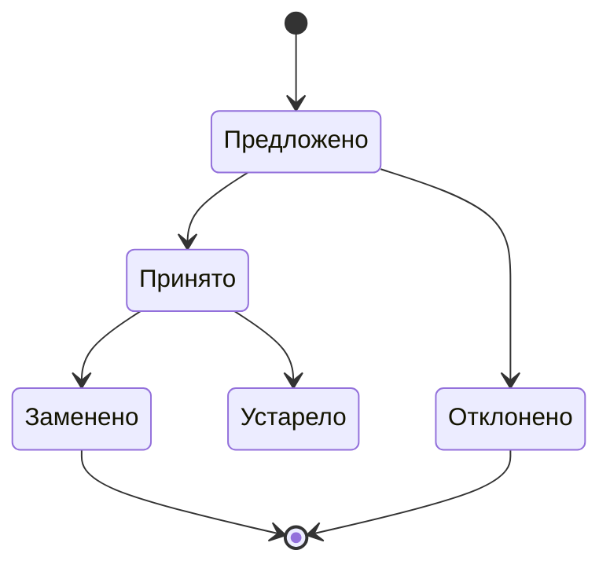

# Отчет об архитектурных решениях

ADR фиксирует **почему** было выбрано определённое техническое решение.

Создавайте ADR, когда решение:

- затрагивает несколько систем;
- требует выбора между несколькими жизнеспособными вариантами;
- будет трудно понять только по итоговому коду.

Не создавайте ADR для обратимой локальной детали, стандартного рефакторинга или выбора, полностью заданного существующими правилами проекта.

## Жизненный цикл

| Статус | Значение |
| --- | --- |
| **Предложено** | Решение открыто для обсуждения. |
| **Принято** | Подход обязателен для новых изменений. |
| **Отклонено** | Рассмотренный подход не выбран; причина сохранена. |
| **Заменено** | Действует более новое ADR, указанное в документе. |
| **Устарело** | Контекст исчез, решение больше не применяется. |

---

## ADR-[№ XXX] · [Краткое название решения]

Статус: предложеноДата: ГГГГ-ММ-ДДАвтор: [имя]

### Контекст

_Какая ситуация требует решения? Какие силы, ограничения, известные риски и неизвестные важны? Опишите проблему без преждевременного выбора реализации._

### Рассмотренные варианты

#### Вариант A · [Название]

_Краткое описание подхода._

**Преимущества**

- …

**Недостатки и риски**

- …

#### Вариант B · [Название]

_Краткое описание подхода._

**Преимущества**

- …

**Недостатки и риски**

- …

### Решение

_Какой вариант выбран? Почему он лучше соответствует критериям в текущем контексте? Какие компромиссы приняты осознанно?_

### Проверка

_Как убедиться, что решение реализовано правильно? Какие тесты, наблюдения или метрики подтверждают результат?_

### Условия пересмотра

_При каких наблюдаемых изменениях ADR нужно открыть заново: масштаб, производительность, изменение требований?_

### Связанные материалы

- **Заменяет:** ADR-[№ XXX] или "нет"
- **Дополняет:** ADR-[№ XXX] или "нет"

### История

| Дата | Статус | Автор | Причина изменения |
| --- | --- | --- | --- |
| ГГГГ-ММ-ДД | Предложено | [имя] | Создано решение |
