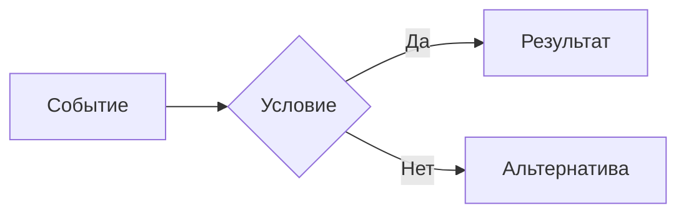

# Как писать документацию

Эта страница задаёт общий редакционный стандарт. Документы должны быть предсказуемыми, чтобы читатель быстро понимал назначение страницы.

## Пишите для конкретного читателя

Перед началом определите, кто откроет страницу и какое действие он должен совершить после чтения.

Если одна страница пытается одинаково подробно обслужить все аудитории, разделите её на обзор и специализированные подразделы.

## Структура страницы

1. **Название** - о чём документ.
2. **Краткое введение** - зачем он существует и что охватывает.
3. **Основной текст** - содержание, ради которого открыта страница.
4. **Связанные документы** - какие страницы упоминаются/что дополняет текущая.

Минимальная заготовка:

```markdown
---
description: Одно предложение о назначении страницы.
---

# Название страницы

Краткое объяснение назначения и границ документа.

## Основной раздел

Содержание.

## Открытые вопросы

- [ ] Вопрос, для которого ещё не принято решение.
```

## Язык и тон

- Пишите по-русски, короткими прямыми предложениями.
- Используйте настоящее время: "система создаёт", а не "система будет создавать".
- Раскрывайте аббревиатуру при первом упоминании на странице.
- Один термин должен обозначать одно понятие во всём проекте.
- Избегайте канцеляризмов.

=== "Лучше"

    "Тяжёлая атака расходует выносливость и оставляет окно для ответа".

=== "Хуже"

    "Предполагается, что тяжёлые атаки будут достаточно сбалансированными".

!!! warning "Не маскируйте неизвестное"
    Если число, механика или ограничение не утверждены, не формулируйте их как факт. Зафиксируйте предположение и способ его проверки.

## Заголовки

- На странице должен быть один заголовок первого уровня `#`.
- Не пропускайте уровни: после `##` используйте `###`, а не `####`.
- Заголовок - утвердительное предложение, описывающее содержание.
- Не дублируйте в заголовке название родительского раздела.
- Избегайте больше четырёх уровней вложенности.

## Имена файлов

Используйте английские имена в `kebab-case`:

```text
core-loop.md
content-pipeline.md
combat.md
```

Файл `index.md` является входной страницей каталога. После публикации не переименовывайте страницу без необходимости.

## Ссылки

Ссылайтесь на исходный Markdown-файл относительно текущей страницы:

```markdown
[Игровой цикл](../gdd/core-loop.md)
[Раздел разработки](../development/index.md)
[Конкретный подраздел](writing.md#заголовки)
```

Не копируйте одинаковый текст на несколько страниц. Оставьте одно описание и поставьте ссылки из зависимых документов.

## Списки и таблицы

Список подходит для независимых пунктов или последовательности. Таблица для сравнения объектов по одинаковым признакам.

Не помещайте в таблицу длинные абзацы.

## Смысловые блоки

Используйте блоки умеренно и по назначению:

```markdown
!!! note "Контекст"
    Дополнительная информация, необходимая для понимания решения.

!!! warning "Риск"
    Последствие, которое нужно учесть до реализации.

!!! question "Открытый вопрос"
    Решение ещё не принято.

!!! tip "Практика"
    Необязательный совет, упрощающий работу.
```

Если вся страница состоит из цветных блоков, их приоритет перестаёт считываться.

## Вкладки

Вкладки подходят для равноправных вариантов - например, разных операционных систем или способов реализации:

```markdown
=== "Windows"

    Содержимое первой вкладки.

=== "Linux"

    Содержимое второй вкладки.
```

Не прячьте во вкладках последовательные шаги.

## Диаграммы

Для таблиц и графиков используйте Mermaid:

````markdown

````

Диаграмма дополняет объяснение, но не должна быть единственным источником важной информации. Подписывайте связи коротко и проверяйте читаемость в светлой и тёмной темах.

## Код и конфигурация

- Указывайте язык блока для подсветки синтаксиса.
- Показывайте минимальный фрагмент, необходимый для мысли.
- Не вставляйте временные идентификаторы.
- Сложный пример дополняйте объяснением ожидаемого результата.

```yaml title="Пример прототипа"
- type: entity
  id: ExampleEntity
```

## Изображения

- Храните изображения в `docs/assets/images/` или тематическом подкаталоге.
- Используйте понятное имя файла без пробелов.
- Добавляйте альтернативный текст, описывающий смысл изображения.
- Не используйте изображение вместо текста. Вся информация должна индексироваться поиском.

```markdown

```

## Доступность

- Добавляйте подписи к таблицам и изображениям, когда без них теряется контекст.
- Избегайте мигающей анимации и автоматически запускаемого медиа.
- Проверяйте страницу при увеличении масштаба.

## Самопроверка автора

- [ ] Назначение страницы понятно по первому экрану.
- [ ] У каждого определения есть однозначная формулировка.
- [ ] Предположения и вопросы не выданы за утверждённые решения.
- [ ] Термины совпадают со [словарём проекта](../project/glossary.md).
- [ ] Ссылки относительные и ведут на существующие `.md`-файлы.
- [ ] Заголовки образуют последовательную иерархию.
- [ ] Страница читается в светлой и тёмной темах.
- [ ] `mkdocs build --strict` завершается успешно.

